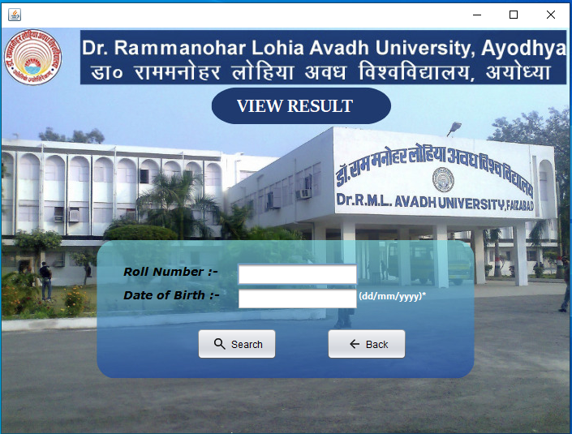

# Student Result Management System (Java Swing)

The Student Result Management System is a desktop application developed using Java Swing to efficiently manage and store student academic information and results. This README file provides an overview of the project, instructions for installation, usage, and other important details.

## Table of Contents
* Introduction
* Features
* Technologies Used
* Installation
* Usage
* Contributing
* License
* Project Screenshots
## Introduction
The Student Result Management System is designed to streamline the process of managing and tracking student's results in educational institutions. The application provides a user-friendly graphical interface for administrators, teachers, and students to perform various tasks related to academic results.

Key functionalities include:

* **Administrator Features:** Manage user accounts, courses, subjects, student records, and generate reports.
* **Teacher Features:** Enter and update student scores, generate class-wise or subject-wise reports.
* **Student Features:** View their results, and track progress.
## Features
The system offers the following features:

* Secure user authentication and authorization for administrators, teachers, and students.
* Easy management of student data, including personal information, courses, and enrolled subjects.
* Convenient input of student exam scores and updating of records by teachers.
* Automatic calculation of total marks, grades, and GPAs based on predefined grading criteria.
* Generation of comprehensive reports for individual students, classes, or subjects.
* User-friendly and intuitive graphical interface using Java Swing.
## Technologies Used
The application is built using the following technologies:

* Java Swing: For the graphical user interface (GUI).
* Java AWT (Abstract Window Toolkit): For building GUI components.
* Java JDBC (Java Database Connectivity): For database communication and management.
* MySQL (or any other preferred database): For storing student and result data.
* Other standard Java libraries and tools.
## Installation
To run the Student Result Management System, follow these steps:

1. Clone or download the project from the repository.

2. Set up the database:

    * Install and configure MySQL (or any other preferred database).
    * Create a new database for the application.
    * Import the database schema and data from the provided SQL file.
3. Open the project in your preferred Java IDE (e.g., Eclipse, IntelliJ IDEA).

4. Configure the database connection:

    * Open the source code for the application.
    * Locate the database configuration file (e.g., `DatabaseConfig.java`).
    * Update the database connection settings (URL, username, password) to match your database.
5. Build and run the application:

    * Build the project in your IDE to compile the Java source code.
    * Run the application from the main class (e.g., `MainApp.java`).
6. The Student Result Management System application window should now open, and you can access the various features based on your user role (administrator, teacher, student).

## Usage
1. As an administrator, you can log in with your credentials and manage student records, courses, subjects, and generate reports.

2. As a teacher, you can log in with your credentials and enter/update student scores, generate class-wise or subject-wise reports.

3. As a student, you can log in with your credentials and view your results, attendance, and other academic information.

## Contributing
We welcome contributions to the Student Result Management System project. If you find any bugs or have ideas for improvements, please feel free to open an issue or submit a pull request with your changes.

Please ensure to follow the code of conduct and guidelines for contributing.

## License
The Student Result Management System is open-source and distributed under the MIT License. Feel free to use, modify, and distribute it as per the terms of the license.

# Project Screenshots

**Thank you for using the Student Result Management System (Java Swing)! If you have any questions or need assistance, please feel free to contact us.**
